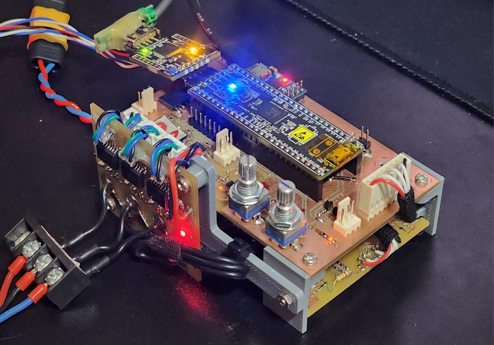

# PMSM FOC Controller on PSoC 5LP

A modular development and test platform for field oriented control (FOC) of low-voltage permanent magnet synchronous machines (PMSM), built around the Cypress/Infineon PSoC 5LP.

<p align="center">
  
</p>

The full FOC algorithm — Clarke and Park transforms, synchronous-frame PI current loops and space vector modulation (SVPWM) — runs on an ARM Cortex-M3 **without a floating point unit**, at a 4 kHz control rate. Absolute rotor position comes from a magnetic encoder, so the machine delivers maximum torque even at zero speed. The hardware is split into four boards and provisions three different current sensing routes, allowing them to be compared (and made redundant) on the same platform.

This project was developed as my Electrical Engineering final project at UFRGS, advised by Prof. Tiago Balen. The PSoC 5LP is not the obvious choice for motor control today — and that is precisely the point: its programmable analog and digital fabric makes it a remarkably flexible substrate for research on fault effects and fault-tolerant controller architectures, which is the intended future of this platform. The focus is not a final product, but a well-instrumented testbed.

## Features

- Complete sensored FOC: Clarke/Park transforms, d/q PI current loops, sector-based SVPWM at 16 kHz;
- Cascaded speed (PID) and position (PD+I) loops, selectable at compile time;
- Optimized for a Cortex-M3 without FPU: LUT-based trigonometry, fast inverse-free math, execution time measured down to WCET histograms (`DutyMeas`);
- Absolute magnetic encoder (Allegro A1339, 12-bit, SPI) with multi-turn position and filtered speed estimation;
- Two-shunt inline current sensing with isolated amplifiers (AMC3301, gain 8.2, 10 mΩ shunt); low-side shunt and inline Hall routes provisioned in hardware;
- Automated step-response test sequences (torque / speed / position) streamed over UART at 460800 bps, with Python plotting scripts;
- Four-board modular hardware with schematics and Gerber files included.

## Control architecture

<p align="center">
  
</p>

Two time-critical tasks run from hardware clock interrupts:

- **HFT (4 kHz)** — reads the encoder angle and the phase currents, runs the current loop (Clarke → Park → d/q PIs → inverse Park → SVPWM) and updates the three PWM compare registers;
- **LFT (1 kHz)** — reads the user references (potentiometers), runs the outer speed or position loop and generates the `Iq` reference for the HFT.

The control mode is selected by a single `#define` in `main.c` (`CONTROL_MODE_TORQUE`, `CONTROL_MODE_SPEED`, `CONTROL_MODE_POSITION`), and the `TEST_MODE_*` variants replace the knob reference with automated step sequences for characterization. The whole controller state lives in a single `xFOC_Ctrl` structure.

Since the current loop is measured with inline shunts but the modulation is referenced to the rotor, the encoder angle is used in two frames: the direct electrical angle for voltage synthesis and a −60° shifted version for current demodulation.

## Hardware

<p align="center">
  
</p>

| Board | Contents |
|---|---|
| **Control Board** | CY8CKIT-059 (CY8C5868LTI-LP039), subtractor amplifiers, user potentiometers, connectors |
| **Power Stage** | DRV8302 gate driver + three-phase MOSFET bridge, bulk capacitors, low-side shunts |
| **Current Sensor** | Inline shunts + AMC3301-Q1 isolated amplifiers (primary current feedback) |
| **Angle Sensor** | A1339 absolute magnetic encoder, mounted at the shaft end |

Each board folder in `Hardware/` carries the schematic (SVG), the PCB layout (PDF) and the Gerber package. The prototypes were milled on a CNC; the boards were designed with that process in mind (single/double layer, generous clearances).

<p align="center">
  
</p>

The test machine is an automotive PMSM: 12 V bus, four pole pairs, sinusoidal BEMF and negligible cogging — a convenient, robust load for low-power dynamic tests.

## Firmware

<p align="center">
  
</p>

The firmware (`Firmware/DTMR_Inverter.cydsn`, PSoC Creator 4.4, C99) is structured in layers: `main` holds the two tasks and the control modes; the libraries (`FOC`, `PID`, `Inverter_Utils`, `DutyMeas`) are hardware-independent; the user-level drivers (`Drv_ADC`, `Drv_PWM`, `Drv_Timer`, `Drv_UART`, `Drv_A1339`, `Drv_Cycle`) wrap the vendor-generated peripherals. Naming follows a strict type-prefix standard (`vFOC_Svpwm`, `bDrvAdc_RunCurrentSense`, `ui16DrvA1339_ReadRawAngle`), functions carry Doxygen briefs, and there is no dynamic allocation.

A significant part of the "schematic" is inside the chip. The PSoC's fabric implements the three synchronized UDB PWMs, the clock dividers that fire the HFT/LFT interrupts, the SAR ADC sequencer for the current channels, the SPI master for the encoder and the µs timer used for execution-time capture:

<p align="center">
  
</p>

## Getting started

1. Open `Firmware/DTMR_Inverter.cydsn` in **PSoC Creator 4.4**;
2. Pick one control mode in `main.c` (all commented out = open voltage control by the potentiometer, the safest first test);
3. Build and program the CY8CKIT-059;
4. On power-up the firmware calibrates the current-sense offsets (~1 s at 50% duty) before enabling the loops;
5. Telemetry is plain text over UART (460800 bps). For the automated tests, `Scripts/` has the plotting tools:

```bash
cd Scripts
pip install -r requirements.txt
python plot_step_response.py   # ref vs. meas from a TEST_MODE_* run
python plot_histogram.py       # execution-time histogram / WCET from DutyMeas
```

## Repository layout

```
├── Firmware/DTMR_Inverter.cydsn/   # PSoC Creator 4.4 project (C sources at the root)
├── Hardware/
│   ├── Control Board/              # schematic, PCB, gerbers
│   ├── Power Stage/
│   ├── Current Sensor/
│   └── Angle Sensor/
├── Scripts/                        # Python plotting / analysis tools
├── Test Data/                      # bench measurements (xlsx)
└── Docs/figures/                   # images used in this README
```

## Status and roadmap

Validated on the bench: SVPWM generation, open-loop voltage drive, closed-loop `Id`/`Iq` tracking, and speed and position control adequate for servo positioning. Next steps: comparative analysis of the three current sensing routes and implementation of redundancy in the critical paths (sensing, modulation), exploring the reconfigurable fabric of the PSoC.

## License

MIT — see [LICENSE](Firmware/DTMR_Inverter.cydsn/LICENSE.txt).

If this platform is useful in your research, the full monograph (in Portuguese) documents the design decisions in detail: *O. N. A. S. Akama, "Desenvolvimento de plataforma para controle vetorial de máquinas PMSM orientado a redundância de sensoriamento com microcontrolador de sinal misto PSoC5LP", UFRGS, 2026. Advisor: Prof. Dr. Tiago Roberto Balen.*
